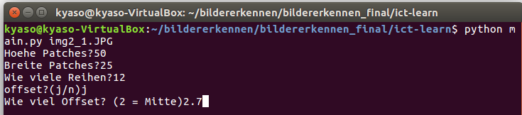
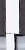
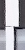

# ICT-Learn

## Voraussetzungen
* **Linux**
* [Tensorflow](https://www.tensorflow.org/versions/r0.10/get_started/os_setup.html#virtualenv-installation)
* TF-Learn: `pip install tflearn`
* Numpy (wird i.d.R. mit TF-Learn mitinstalliert)
* [OpenCV](http://docs.opencv.org/2.4/doc/tutorials/introduction/linux_install/linux_install.html#linux-installation)
- Matplotlib

- - -

## Bedienung

### Lamellen ausschneiden

1. In `cut_image.py`
  * in "`seite.open...`" Name der Texdatei mit den Labels angeben
  * Falls keine Textdatei mit den Labels vorhanden, einfach unverändert lassen
    * man kann hinterher in der Funktion `classify()` (in `slat_train.py`) angeben, dass man keine korrekten Labels hat
2. Terminal: `python main.py [Bild.jpg]`
  - Höhe: 50
  - Breite: 25
  - Reihen: Immer *eins mehr* angeben. Möchte man z.B. 5 Reihen decodieren, so muss man 6 eingeben
  - Offset: 2, falls genau mittig.  
    \>= **2.7**, falls mehr von der oberen Reihe sichtbar sein soll (**empfohlen**) 

  
  
     
  *Links: Offset 2.7, Rechts Offset 2*

3. Ecken auswählen
  - Einmal ins Bild klicken: Ausschnitt vergrößern
  - Nochmal klick: Ecke auswählen ODER Rechtsklick zum abbrechen
  - Falls Ausschnitt sich **nicht** vergrößert: Rechtsklick, und nochmal etwas weiter unten linksklicken (so dass man die Ecke noch sieht;
	falls nicht, einfach mit Rechtsklick abbrechen)
  - Reihenfolge: links oben, rechts oben, rechts unten, links unten
  - Geschnittene Bilder mit labels befinden sich nun im Ordner "bilder1"
    - Falls man keine label txt hatte, sind die Labels in den Bildnamen natürlich falsch; also nicht verwirren lassen!
    - Falls die Bilder für **neue Trainingsdaten** geschnitten wurden
      - nur die guten Ausschnitte kopieren
      - `recog/OFFSET/` dort einen neuen Ordner "cropped_blabla" erstellen
      - dort einfügen

### Trainieren/Testen

Terminal im Ordner `recog` öffnen

- **Falls man ein bereits existierendes Netz *trainieren* möchte: Gehe zu 1.)**  
- **Falls man ein bereits existierendes Netz *testen* möchte: Gehe zu 2.)**
- Falls man ein **neues** Netz trainieren möchte: Python Datei für ein neuronales Netz anlegen, z.B. `dnn1_bw.py`
  - Inhalt von `dnn1_bw.py` kann als Grundstruktur übernommen weren
  - Dann entsprechend modifizieren
  - (*optional*) Tensorboard Pfad festlegen, z.B. `tensorboard_dir='/home/kyaso/ict/dnn1_bw_logs'` (home.. anpassen an eigenen Rechner)
    - Kann man auch weglassen, dann ist der Standardpfad `/tmp/tflearn_logs/`

1. In `slat_train.py`
  - Neuronales Netz importieren, z.B. `import dnn1_bw.py as net`
  - Trainingsbilder auswählen (`load_images...`), entsprechendes auskommentieren oder hinzufügen
  - Falls Netz zum ersten Mal trainiert wird: `net.m.load...` auskommentieren
    - Nach erstem Training kann man den Kommentar wieder entfernen
  - (*optional*) Test Ordner festlegen
  - Classify aufrufen (genaueres steht als Kommentar darüber (ganz unten in `slat_train.py`))

2. Falls man das Netz nur testen und nicht trainieren möchte
  - `recognize.py` öffnen
  - Neuronales Netz importieren
    - z.B. `import dnn1_bw.py as net`
  - `net.m.load("DasNetz.tflearn")`
  - Test Ordner festlegen
  - Classify

3. Tensorboard (*optional*)
  - Terminal öffen
  - Eingeben, z.B.: `tensorboard --logdir="/home/kyaso/ict/dnn1_bw_logs"`
    - Falls Standardpfad: `--logdir="/tmp/tflearn_logs/"`
  - Im Browser `http://0.0.0.0:6006` aufrufen

Das von uns final trainierte neuronale Netz `dnn1_bw` erkennt schwarz-weiß Ausschnitte mit einem Offsetwert von 2.7. Entsprechende Trainingsbilder befinden sich im Ordner `recog/OFFSET`.
